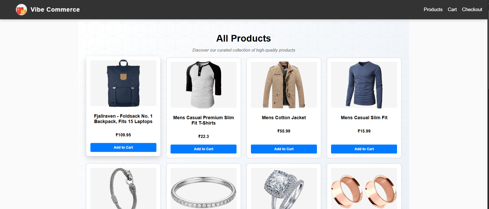
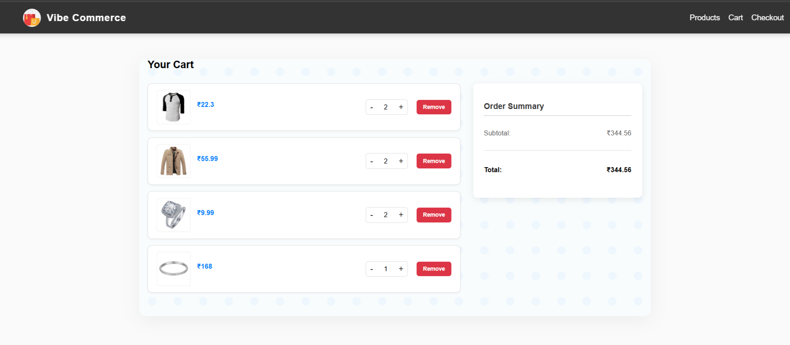
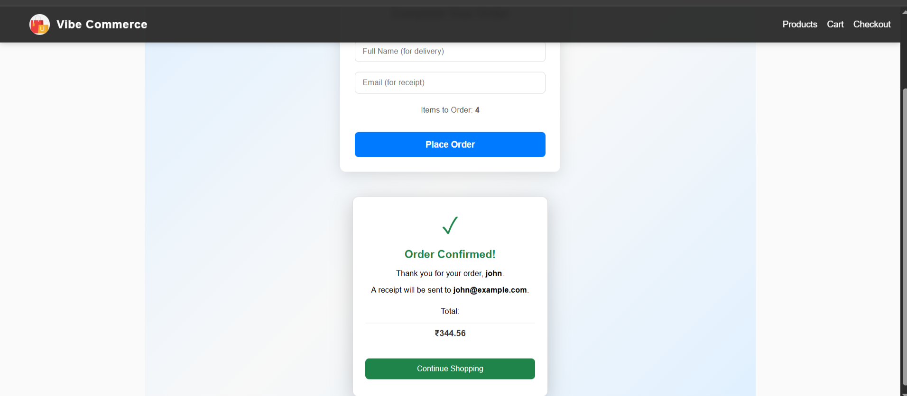

# 🛒 Full-Stack E-commerce Cart Application

A robust and modern full-stack application for managing products and shopping carts. Built using the Full stack with Fake Store API integration.

---

## 🛠️ Tech Stack

| Component | Technologies |
| :--- | :--- |
| **Frontend** | React |
| **Backend** | Node.js |
| **Database** | MongoDB |
| **API** | Fake Store API (External Data Source) |

---

## ✨ Features

- **🛍️ Browse:** View and explore products fetched from the Fake Store API.
- **➕ Add to Cart:** Easily add items to the cart.
- **🔢 Quantity Control:** Update item quantities directly in the cart.
- **❌ Remove Item:** Delete unwanted items from the cart.
- **💰 Checkout:** Simulated checkout process.
- **⚠️ Error Handling:** Robust error handling.
- **📱 Responsive Design:** Seamless experience across desktop, tablet, and mobile devices.

---

## 📂 Folder Structure

The project is cleanly separated into two main directories:

- `/frontend` - Contains the React application code.
- `/backend`- Contains the Node.js and MongoDB configuration.

---

## 🚀 How to Run the Application

### 1. Backend Setup

```bash

cd backend
npm install
npm start

```

### 2. Database Setup

This project uses **MongoDB** for storing products and cart items.  

1. Make sure MongoDB is running locally or provide a connection URL in `.env`.  
2. Populate the database with initial products using:

```bash

 cd backend 
node data.js
```

### 3. Frontend setup

```bash
cd frontend
npm install
npm run dev

```

---

### Screenshots

- Home / Products Page:
  

- Cart Page:
  

- Checkout Page:
  
